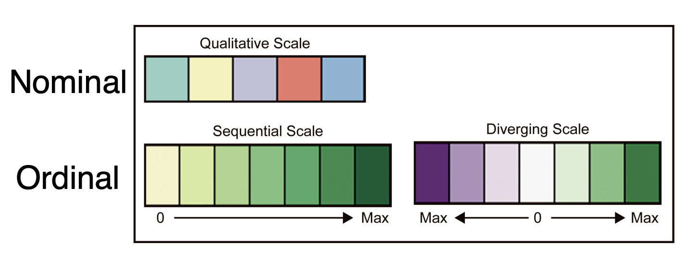

```{r setup, include=FALSE}
options(htmltools.dir.version = FALSE)
library(here)
```

layout: true

<div class="my-header"></div>
<div class="my-footer">
  <div class="my-info">
      <a href="https://marionlouveaux.fr/">marionlouveaux.fr</a>
      <a href="https://twitter.com/MarionLouveaux">@MarionLouveaux</a>
  </div>
  <div class="my-logo">
  </div>
</div>       

---

# From images... to images

```{r, echo=FALSE}
knitr::include_graphics("images/bioimage_analysis_workflow.png")
```


---


# Graphicacy

```{r, echo=FALSE, fig.align='center'}

```
  

"**Scientists** [...] **ought to create visualizations that are as transparent as possible** [...] but **readers** often have the unrealistic **expectation that any graphic should be understandable without effort**. [...] Audiences often lack knowledge of graphic symbols, grammar, and conventions" => "help increase readers's **graphicacy**." *Albert Cairo*   

**Graphicacy**: the **ability to understand and present information** in the form of sketches, photographs, diagrams, maps, plans, charts, graphs and other non-textual formats.
     

>  http://www.thefunctionalart.com/2019/09/explaining-visualizations-in-new-york.html
https://www.nytimes.com/interactive/2019/08/29/opinion/hurricane-dorian-forecast-map.html 
https://en.wikipedia.org/wiki/Graphicacy

???
Data viz real complex job
Misunderstanding graph = real-world consequences 
hurricane Irma, 2017 approaching Florida East Coast
Predictive map of hurricane trajectory shown on TV, represents the most probable trajectory + uncertainty
People at the center packing
Irma took another trajectory, people off the most probable trajectory not prepared

viz = info summary, with conventions, symbols etc. 
here central path = most probable, cone = zone in which path can be with some proba treshold, not where it will hit
your role = have a good graphicacy, be aware that your reader might lack it

---


# Graphs        
 
- Choice of graphical representation tightly related to your question          
- Presentation of information should be **clear, accessible, reliable and transparent**            
          
```{r, echo=FALSE, fig.align='center'}

```

> Adapated from https://www.r-graph-gallery.com/            
See also https://www.data-to-viz.com/             


???
What information do you want to present? = What is your message? To which question do you answer?       
=> Choice of graphical representation matters      
It is tightly related to your question. 

It also affects your data exploration (you might miss some important info in your data with the wrong data representation). 


---


# Clarity 

## Less is more


```{r, echo=FALSE, out.width="50%"}


```

Original London subway map from 1927 takes geography into account.             


> https://towardsdatascience.com/the-power-of-visualization-in-data-science-1995d56e4208              
---


# Clarity 

## Less is more


```{r, echo=FALSE, fig.align='center', out.width="50%"}
knitr::include_graphics("images/data-ink.gif")
```
        
- **Color**: Reduce colors, remove shadows and glossy effects for decoration  
- **Accessory elements**: Remove or lighten background, borders, grid lines 
- **Information**: Remove redundant information & prioritize info             

> https://www.darkhorseanalytics.com/blog/data-looks-better-naked        


---


# Clarity 

## Colors matter

.pull-left[
- No more than 6 to 7 colors
- Easily **separable**
    - Color blind compatible
    - Printer-friendly  
    - Contrasted     
    - Grey color is favoured                             
- **Meaningful**
    - Add an extra information / highlight specific elements (not redundant or random)      
    - Light colors -> low values, dark colors -> high values
- **Consistent**     
    - Same color for the same variable between all graphs               
]          


.pull-right[
```{r, echo=FALSE, fig.align='center'}

```

```{r, echo=FALSE, fig.align='center', out.width="90%"}

```

]              
            
> https://blog.datawrapper.de/colors/                
ColorBrewer: http://colorbrewer2.org/#type=sequential&scheme=BuGn&n=3         
    

???
Are your data sequential = ordered from low to high
diverging = ordered from low to high, mid-range value matters (for instance, mid-range = average value)
qualitative = non ordered data (categories, groups...)


---


# Accessibility

## The right graph   


```{r, echo=FALSE, message=FALSE, warning=FALSE, fig.align='center', out.width="100%", fig.width=20}
library(dplyr)
library(ggplot2)
library(ggridges)
library(cowplot)

custom_plot_theme <- function(...){
theme_classic() +
theme(panel.grid = element_blank(),
      axis.line = element_line(size = .7, color = "black"),
      plot.title = element_text(size = 34),
axis.text = element_text(size = 28),
axis.title = element_text(size = 32),
legend.text = element_text(size = 28),
legend.title = element_text(size = 32),
legend.key.size = unit(0.4, "cm"),
strip.text.x = element_text(size = 32, colour = "black", angle = 0),
strip.text.y = element_text(size = 32, colour = "black", angle = 90))
}

p1 <- ggplot(storms, aes(x=wind, y=pressure))+
  geom_point() +
  custom_plot_theme()

p2 <- ggplot(storms, aes(x=as.factor(cut(wind, breaks=seq(0, max(wind), 20))), y=pressure))+
  geom_boxplot() +
  xlab("wind classes") +
  custom_plot_theme() +
  theme(axis.text.x = element_text(angle=45, hjust = 1))

p3 <- ggplot(storms, aes(x=as.factor(cut(wind, breaks=seq(0, max(wind), 20))), y=pressure))+
  geom_violin() +
  xlab("wind classes") +
  custom_plot_theme() +
  theme(axis.text.x = element_text(angle=45, hjust = 1))

plot_grid(p1, p2, p3, labels = c("A", "B", "C"), nrow = 1, label_size = 30)

```

> https://www.data-to-viz.com/caveat/boxplot.html                    
http://www.storytellingwithdata.com/blog?offset=1569328920602                    

???
boxplots summarize a lot the info, they are good when distribution is known and easy to understand when distrib is gaussian, otherwise, they can hide the distribution of data
When looking at distributions, violin plots or ridges when there is many distributions give more info xs


barplots for numerical ~ categorical variables
line plots for numerical ~ numerical 


---


# Accessibility

## The right scale  
        
- Histogram bin size          

```{r, echo=FALSE, fig.align='center', out.width="90%", fig.width=30}
p1 <- ggplot(storms, aes(x=wind))+
  geom_histogram(bins = 15) +
  labs(title = "15 bins") +
  custom_plot_theme()

p2 <- ggplot(storms, aes(x=wind))+
  geom_histogram(bins = 30) +
  labs(title = "30 bins") +
  custom_plot_theme()

plot_grid(p1, p2, labels = c('A', 'B'), label_size = 30)
```


- Aspect ratio    
```{r, echo=FALSE, fig.align='center', out.width="90%", fig.width=90}
ggplot(storms, aes(x=wind))+
  geom_histogram(bins = 30) +
  labs(title = "30 bins") +
  custom_plot_theme()
```

> https://www.data-to-viz.com/caveat/bin_size.html                
https://www.data-to-viz.com/caveat/aspect_ratio.html           

???
ratio of the width to the height of a graphic. 
- Play with the aspect ratio of the graph to highlight the best the trend in your data. 
- In histograms, bin size also matters.   

---


# Accessibility 

## A tidy graph

- Order data 
- Highlight some elements of the graph     

```{r, echo=FALSE, fig.align='center', fig.width=20}
p1 <- storms %>%
  filter(status=="hurricane") %>% 
  group_by(year) %>% 
  summarize(n = n()) %>%
  top_n(15, n) %>%
  mutate(year=factor(year, year)) %>%
  ggplot( aes(x=year, y=n) ) +
    geom_segment( aes(x=year ,xend=year, y=0, yend=n), color="grey") +
    geom_point(size=3, color="#69b3a2") +
    coord_flip() +
    xlab("") +
  custom_plot_theme()


p2 <- storms %>%
  filter(status=="hurricane") %>% 
  group_by(year) %>% 
  summarize(n = n()) %>%
  arrange(n) %>%
  top_n(15, n) %>%
  mutate(year=factor(year, year)) %>%
  ggplot( aes(x=year, y=n) ) +
    geom_segment( aes(x=year ,xend=year, y=0, yend=n), color="grey") +
    geom_point(size=3, color="#69b3a2") +
    coord_flip() +
    xlab("") +
  custom_plot_theme()

#highlight 1989
p3 <- storms %>%
  filter(status=="hurricane") %>% 
  group_by(year) %>% 
  summarize(n = n()) %>%
  arrange(n) %>%
  top_n(15, n) %>%
  mutate( highlight=ifelse(year=="1989", "1989", "Other")) %>%
  mutate(year=factor(year, year)) %>%
  ggplot( aes(x=year, y=n, size=highlight) ) +
    geom_segment( aes(x=year ,xend=year, y=0, yend=n, color=highlight)) +
    geom_point(size=3, color="#69b3a2") +
  scale_color_manual(values = c("#69b3a2", "lightgrey")) +
    scale_size_manual(values=c(1.5,0.2)) +
    coord_flip() +
    xlab("") +
  ylab("Number of hurricanes")+
  custom_plot_theme() +
  theme(legend.position="none") +
  geom_label( x=2, y=180, label="1989 is among\nthe 10 worst years", size=8, color="#69b3a2") 

plot_grid(p1, p2, p3, labels = c('A', 'B', 'C'), label_size = 30, nrow=1)
```


> https://www.data-to-viz.com/caveat/spaghetti.html                      
https://www.data-to-viz.com/caveat/overplotting.html                    
https://www.data-to-viz.com/caveat/order_data.html                           
https://www.data-to-viz.com/caveat/connect_your_dot.html                         
https://www.data-to-viz.com/caveat/grouped_bar.html                      

???
If one group matters more than the others, or has a different behavior than the others, depends on your message/question      


---


# Accessibility 

## Annotations 

- Annotate the graph    
- Shorten labels
- If necessary, switch axes for categorical variables   

```{r, echo=FALSE, fig.align='center', out.width="40%", fig.width=10}
ggplot(storms, aes(x=as.factor(cut(wind, breaks=seq(0, max(wind), 20))), y=pressure))+
  geom_violin(size=1) +
  xlab(label="max wind speed") +
  custom_plot_theme() +
  scale_x_discrete(labels=seq(20, 160, 20)) +
  annotate(geom = "curve", x = 2, y = 1025, xend = 1, yend = 1013, 
    curvature = .3, arrow = arrow(length = unit(2, "mm"))) +
  annotate(geom = "text", x = 2, y = 1025, label = "nice weather", hjust = "left", size=7) +
  annotate(geom = "curve", x = 7.5, y = 965, xend = 8, yend = 940, 
    curvature = -.3, arrow = arrow(length = unit(2, "mm"))) +
  annotate(geom = "text", x = 6.5, y = 980, label = "better\nstay inside", hjust = "left", size=7)
```

> https://www.data-to-viz.com/caveat/annotation.html                  
https://www.data-to-viz.com/caveat/hard_label.html                      

???
and legend
Add arrows, pay attention to the legend, depends on your message
as much as possible


---


# Reliability
## No mental arithmetic

- Visual perception: better for length than areas and volumes       
- Optical illusions: context matters         

```{r, echo=FALSE, fig.align='center'}
knitr::include_graphics("images/visualperception.png") 
```


> https://hackmd.io/zS8OW22LR3mGArfX_9gi2A                 
https://homepage.divms.uiowa.edu/~luke/classes/STAT4580/percep.html             


---

# Reliability
## No mental arithmetic

```{r, echo=FALSE, fig.align='center', out.width="60%"}

```

> https://www.data-to-viz.com/caveat/pie.html                 
https://www.data-to-viz.com/caveat/radius_or_area.html                  
https://www.data-to-viz.com/caveat/area_hard.html                 
 

---


# Reliability

## Don't be counter-intuitive              

```{r, echo=FALSE}

```


> https://www.data-to-viz.com/caveat/counter_intuitive.html        
https://junkcharts.typepad.com/junk_charts/simplicity/        


---


# Reliability

## Don't use misleading representations

- Avoid distorted graphs and 3D               
- Don't cut y axis on barplots      


.pull-left[
```{r, echo=FALSE, fig.align='center'}

```
]
.pull-right[
```{r,echo=FALSE, fig.align='center'}

```
]

> https://www.data-to-viz.com/caveat/circular_barplot_accordeon.html                  
https://viz.wtf/post/185041906238/not-as-cheap-as-youd-think                    
https://www.data-to-viz.com/caveat/cut_y_axis.html                     
https://www.data-to-viz.com/caveat/3d.html                       


---


# Reliability

## Don't use misleading representations

- Dual y axis            
```{r, echo=FALSE, out.width="90%", fig.align='center'}
knitr::include_graphics("images/dualaxis_image.png")
```

>  https://junkcharts.typepad.com/junk_charts/2019/11/graph-literacy-in-a-sense.html                             
https://blog.datawrapper.de/dualaxis/                      
https://edaemeklioglu.wordpress.com/2015/02/15/wtf-visualizations/                       

???
scales of each y axis are arbitrary => can be misleading 

---


# Reliability

## Don't use misleading representations


- Barbarplot         
```{r, echo=FALSE, out.width="65%", fig.align='center'}

```

>https://www.data-to-viz.com/caveat/error_bar.html                                 
Weissgerber et al. 2015                    


---


# Transparency
## Automate graph production, avoid introducing mistakes   


.pull-left[
```{r, echo=FALSE, fig.align='center', out.width="50%"}
        
```

```{r, echo=FALSE, fig.align='center', out.width="70%"}

```
]
              
.pull-right[
<br>    
<br>    
```{r, echo=FALSE, out.width="30%", fig.align='center'}

```
                
No manual manipulation of raw data or graphical representations!!!
]

       
> https://www.data-to-viz.com/caveat/calculation_error.html                                              
https://viz.wtf/post/169392205697/fewer-people-would-have-a-hard-time-giving-up                            
https://viz.wtf/post/59697293967/hes-243-baby-boomer                  

---


# Transparency
## Share your code

Graphs should be reproducible from raw data + your code

- Upload your code on GitHub or GitLab
- Share the raw data            
- Reference both with Zenodo (DOI)    

```{r, echo=FALSE, out.width="30%"}
knitr::include_graphics("images/Octocat.png")
knitr::include_graphics("images/gitlab-logo-gray-rgb.png")
knitr::include_graphics("images/zenodo-gradient-2500.png")
```

> https://github.com/            
https://about.gitlab.com/      
https://zenodo.org/          


???
Provide the code you used to create your graphs.   
Direct integration between GitHub and Zenodo


---


# Acknowledgements     

- **Local organisers**: Fabrice Cordelières and Florian Levet.       
- **NEUBIAS Vice-Chair and TS15 co-organiser**: Kota Miura.       
- **NEUBIAS Chair**: Julien Colombelli.     
        
      


